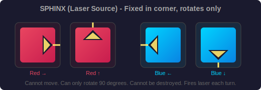
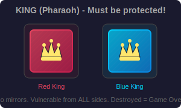
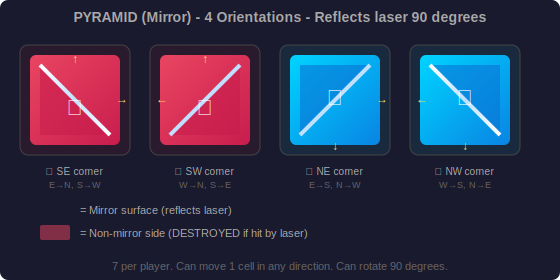
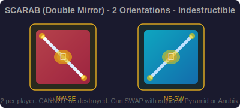
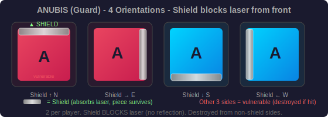
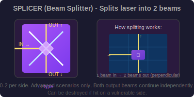
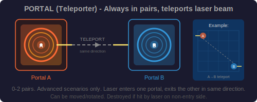
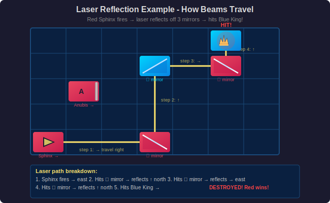
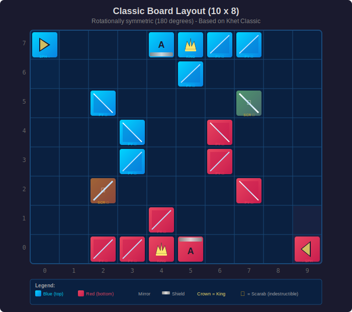

# CHESS with LASERS - Game Design Document

## 1. Game Overview

### 1.1 Concept

A turn-based strategy board game where two players move and rotate pieces on a grid to direct laser beams. The goal is to destroy the opponent's **King** piece by hitting it with a laser. Inspired by Khet (Laser Chess) and the Steam game "CHESS with LASERS" by Coreffect Interactive.

### 1.2 Genre

Turn-Based Strategy / Board Game / Puzzle

### 1.3 Target Platform

Web browser (HTML5 + Canvas/WebGL), playable on desktop and tablet.

### 1.4 Players

2 players (Red vs Blue). Supports:
- Local multiplayer (hot-seat on same device)
- AI opponent (single player)
- Online multiplayer (future phase)

---

## 2. Game Rules

### 2.1 Board

- **10 columns x 8 rows** grid (same as Khet 2.0)
- Columns labeled 0-9 (left to right), rows labeled 0-7 (bottom to top)
- Each cell can hold at most one piece
- **Color-restricted zones**: certain cells near each player's edge can only be occupied by that player's pieces (marked with player color)
  - Red restricted cells: columns 0, rows 0-1 corners
  - Blue restricted cells: columns 9, rows 6-7 corners
- The board has a neutral zone in the center accessible to both players

### 2.2 Turn Structure

1. The active player performs **exactly one** of the following actions:
   - **Move** a piece one cell in any direction (8 directions: N, S, E, W, NE, NW, SE, SW)
   - **Rotate** a piece 90 degrees (clockwise or counterclockwise)
   - **Swap** (Scarab/Shield only): swap positions with an adjacent Pyramid or Anubis piece
   - **Special ability** (for pieces that have one, e.g., Splicer, Portal, Disruptor)
2. After the action, the player's **laser fires automatically** from their Sphinx/Laser piece
3. The laser beam travels along its path, reflecting off mirrors, splitting at splicers, teleporting through portals
4. Any piece hit by the laser on a **non-protected side** is **destroyed and removed** from the board
5. **Friendly fire is enabled** — a player can destroy their own pieces
6. Turn passes to the opponent

### 2.3 Win Condition

- Destroy the opponent's **King** piece with a laser beam
- If a player destroys their own King (friendly fire), they **lose**
- Optional: draw by agreement or after N turns with no captures

### 2.4 Special Rules

- **Green/Neutral pieces**: Some scenarios include neutral pieces (green) that can be moved by either player on their turn
- **Sphinx cannot move**: The laser source piece is fixed in its corner — it can only be rotated
- **No stacking**: A piece cannot move onto an occupied cell (except Scarab swap)
- **Color zones**: Pieces with color restrictions cannot enter the opponent's restricted zones

---

## 3. Piece Types

### 3.1 Piece Summary Table

| Piece | Count per Player | Can Move | Can Rotate | Mirror Sides | Special Ability | Can Be Destroyed |
|-------|-----------------|----------|------------|--------------|-----------------|------------------|
| **Sphinx (Laser)** | 1 | No | Yes | None | Fires laser | No |
| **King (Pharaoh)** | 1 | Yes | No | None | None | Yes (lose condition) |
| **Pyramid** | 7 | Yes | Yes | 1 diagonal | Reflects laser 90 deg | Yes (non-mirror side) |
| **Scarab (Shield)** | 2 | Yes | Yes | 2 sides (V-shape) | Can swap with adjacent Pyramid/Anubis | No |
| **Anubis (Guard)** | 2 | Yes | Yes | 1 front shield | Blocks laser from front | Yes (non-shield side) |
| **Splicer** | 0-2 | Yes | Yes | 2 perpendicular mirrors | Splits laser into 2 beams | Yes |
| **Portal** | 0-2 (paired) | Yes | Yes | None | Teleports laser to paired portal | Yes |
| **Disruptor** | 0-2 | Yes | No | None | Disables adjacent enemy pieces for 1 turn | Yes |

### 3.2 Detailed Piece Descriptions

#### Sphinx (Laser Source)



- Fixed in corner of the board (cannot move, only rotate)
- Fires a laser beam in the direction it faces after each turn
- Each player has exactly one Sphinx
- Cannot be destroyed
- Red Sphinx: bottom-right corner (row 0, col 9) or bottom-left corner (row 0, col 0)
- Blue Sphinx: top-left corner (row 7, col 0) or top-right corner (row 7, col 9)

#### King (Pharaoh)



- The most important piece — losing it means losing the game
- Can move one cell in any direction
- Cannot rotate (no directional component)
- Has no mirrors — vulnerable to laser from any direction
- Must be protected by other pieces at all times

#### Pyramid (Mirror)



- Has a single diagonal mirror on one face
- Reflects the laser beam 90 degrees
- If hit on the **non-mirrored side**, it is destroyed
- Can move one cell in any direction
- Can be rotated 90 degrees
- The primary building block for creating laser paths

#### Scarab (Shield / Double Mirror)



- Has mirrors on **two opposite diagonal sides**
- Reflects laser from either mirrored side
- **Cannot be destroyed** by laser (always reflects)
- Can swap positions with an adjacent Pyramid or Anubis piece (unique ability)
- Can move one cell in any direction
- Can be rotated 90 degrees
- Acts as an indestructible reflector and tactical repositioning tool

#### Anubis (Guard)



- Has a shield on one face (front)
- **Blocks** the laser from the shielded front side (absorbs it, no reflection)
- **Destroyed** if hit from any non-shielded side (back, left, right)
- Can move one cell in any direction
- Can be rotated 90 degrees
- Used as a defensive wall to protect the King

#### Splicer (Beam Splitter)



- **Splits** an incoming laser beam into **two beams** at 90 degrees to each other
- Both output beams continue independently and can hit/reflect off other pieces
- Can be destroyed if hit (in scenarios where it has a vulnerable side)
- Available in specific scenarios/maps (not in classic layout)
- Adds significant tactical complexity

#### Portal (Teleporter)



- Always comes in **pairs** (Portal A and Portal B)
- A laser entering one portal **exits the other portal** in the same direction
- Can be moved and rotated like other pieces
- Destroyed if hit by laser on a non-entry side
- Available in specific scenarios/maps (not in classic layout)
- Creates long-range laser redirection possibilities

#### Disruptor


- Passive area-of-effect ability
- **Disables** enemy pieces in adjacent cells (8 surrounding cells)
- Disabled pieces cannot be moved or rotated on the next turn
- Can be moved one cell in any direction
- Cannot be rotated (omnidirectional effect)
- Destroyed if hit by laser
- Available in specific scenarios/maps

---

## 4. Laser Mechanics

### 4.1 Laser Beam Physics

```
Laser firing sequence:
1. Beam originates from Sphinx in its facing direction
2. Beam travels in a straight line cell by cell
3. At each cell, check for piece interaction:
   a. Empty cell → beam continues
   b. Mirror (correct angle) → beam reflects 90°
   c. Scarab → beam reflects 90°
   d. Anubis (front shield) → beam absorbed (stops)
   e. Anubis (non-shield side) → piece destroyed, beam stops
   f. Pyramid (mirror side) → beam reflects 90°
   g. Pyramid (non-mirror side) → piece destroyed, beam stops
   h. King → piece destroyed, game over
   i. Splicer → beam splits into 2, both continue
   j. Portal → beam teleports to paired portal, continues same direction
   k. Board edge → beam stops
4. Process ALL beam paths (including splits) simultaneously
```

### 4.2 Beam Reflection Rules

```
Incoming direction + Mirror orientation = Outgoing direction

Mirror type ◢ (NW corner):
  → (East)  hits mirror → ↑ (North)  reflected up
  ↓ (South) hits mirror → ← (West)   reflected left

Mirror type ◣ (NE corner):
  ← (West)  hits mirror → ↑ (North)  reflected up
  ↓ (South) hits mirror → → (East)   reflected right

Mirror type ◥ (SW corner):
  → (East)  hits mirror → ↓ (South)  reflected down
  ↑ (North) hits mirror → ← (West)   reflected left

Mirror type ◤ (SE corner):
  ← (West)  hits mirror → ↓ (South)  reflected down
  ↑ (North) hits mirror → → (East)   reflected right
```

### 4.3 Beam Visualization



- The laser beam should be rendered as a visible line/ray across the board
- Show the full path including all reflections
- Animate the beam firing after each turn (brief animation ~0.5s)
- Pieces destroyed by the laser should have a destruction animation
- Split beams (from Splicer) shown as two distinct beams
- Portal teleportation shown with a visual link effect

---

## 5. Board Layouts

### 5.1 Classic Layout (Khet-style)



```
     Col: 0    1    2    3    4    5    6    7    8    9
Row 7: [B-Sp] [  ] [  ] [  ] [B-An] [B-Py] [B-Py] [B-Py] [  ] [  ]
Row 6: [  ] [  ] [  ] [  ] [  ] [  ] [  ] [  ] [  ] [  ]
Row 5: [  ] [  ] [B-Py] [  ] [  ] [  ] [  ] [B-Sc] [  ] [  ]
Row 4: [  ] [  ] [  ] [B-Py] [  ] [  ] [R-Py] [  ] [  ] [  ]
Row 3: [  ] [  ] [  ] [B-Py] [  ] [  ] [R-Py] [  ] [  ] [  ]
Row 2: [  ] [  ] [R-Sc] [  ] [  ] [  ] [  ] [R-Py] [  ] [  ]
Row 1: [  ] [  ] [  ] [  ] [  ] [  ] [  ] [  ] [  ] [  ]
Row 0: [  ] [  ] [R-Py] [R-Py] [R-Py] [R-An] [  ] [  ] [  ] [R-Sp]

Legend: 
  B-Sp = Blue Sphinx (faces right →)
  R-Sp = Red Sphinx (faces left ←)
  B-Py = Blue Pyramid (various orientations)
  R-Py = Red Pyramid (various orientations)
  B-An = Blue Anubis
  R-An = Red Anubis  
  B-Sc = Blue Scarab
  R-Sc = Red Scarab
  B-Kg = Blue King (placed near Anubis)
  R-Kg = Red King (placed near Anubis)
```

Note: King placement and exact mirror orientations will be defined in the implementation. The classic layout is rotationally symmetric (180 degrees).

### 5.2 Beginner Layout

A simplified layout with fewer pieces for learning:
- Fewer Pyramids (3 per player)
- No Scarabs
- King more exposed to encourage quick games
- Clear laser paths for learning reflection mechanics

### 5.3 Advanced Layout (with Special Pieces)

- Includes Splicers, Portals, and/or Disruptors
- More complex starting positions
- Neutral (green) pieces in the center

### 5.4 Custom Layout (Level Editor)

Players can create and save custom layouts using the built-in level editor.

---

## 6. Game Modes

### 6.1 Local Multiplayer (Hot-Seat)

- Two players share the same device
- Board may optionally rotate between turns so each player sees from their perspective
- Turn timer optional (configurable: 30s, 60s, 120s, unlimited)

### 6.2 Single Player vs AI

- AI difficulty levels: Easy, Medium, Hard
- AI uses minimax/alpha-beta pruning with evaluation heuristics:
  - King safety (distance from laser paths)
  - Piece advantage (material count)
  - Laser path proximity to opponent's King
  - Defensive coverage of own King
- Optional hint system showing suggested moves

### 6.3 Tutorial Mode

- Step-by-step interactive lessons:
  1. **Basics**: How to move and rotate pieces
  2. **Mirrors**: Understanding laser reflection
  3. **Defense**: Protecting your King with Anubis and Pyramids
  4. **Attack**: Setting up laser paths to the opponent's King
  5. **Advanced**: Scarab swaps, Splicers, Portals
  6. **Strategy**: Common patterns and tactics
- Each lesson has a puzzle/challenge to complete

### 6.4 Puzzle Mode

- Pre-designed puzzles: "Destroy the opponent's King in N moves"
- Difficulty categories: Beginner, Intermediate, Advanced, Expert
- Solutions verified, hints available

### 6.5 Level Editor

- Drag-and-drop pieces onto the board
- Set piece orientation
- Choose available piece types
- Save/load custom layouts
- Play custom layouts in any game mode

### 6.6 Online Multiplayer (Future Phase)

- Matchmaking or invite-based
- ELO/ranking system
- Game history and replay

---

## 7. UI Design

### 7.1 Visual Style

**Art direction**: Clean, modern, sci-fi aesthetic with a dark theme.

- **Color palette**:
  - Background: Dark gray / near-black (#1a1a2e, #16213e)
  - Board: Dark blue-gray with subtle grid lines (#0f3460)
  - Red player: Warm red / crimson (#e94560, #c81d4e)
  - Blue player: Electric blue / cyan (#00d4ff, #0984e3)
  - Neutral pieces: Green (#00b894)
  - Laser beam: Bright yellow-white glow (#ffe66d → #fff) with bloom effect
  - UI elements: White text on dark backgrounds with accent color highlights
- **Board style**: Flat top-down view with subtle 3D depth (shadows, beveled edges)
- **Pieces**: 2D top-down icons with clear silhouettes and directional indicators
- **Animations**: Smooth piece movement, laser beam firing animation, piece destruction particles

### 7.2 Screen Layout

#### Main Menu
```
┌──────────────────────────────────────────────────────┐
│                                                      │
│              ♜ CHESS with LASERS ♜                    │
│              ═══════════════════                      │
│                                                      │
│              [ ▶ Play ]                               │
│              [ 🧩 Puzzle Mode ]                       │
│              [ 📖 Tutorial ]                          │
│              [ 🔧 Level Editor ]                      │
│              [ ⚙ Settings ]                           │
│                                                      │
│                                       v0.1.0         │
└──────────────────────────────────────────────────────┘
```

#### Game Mode Selection
```
┌──────────────────────────────────────────────────────┐
│  ← Back                    Select Mode               │
│                                                      │
│   ┌─────────────┐  ┌─────────────┐                   │
│   │   👤 vs 🤖  │  │  👤 vs 👤   │                   │
│   │  Single      │  │  Local      │                   │
│   │  Player      │  │  Multiplayer│                   │
│   └─────────────┘  └─────────────┘                   │
│                                                      │
│   Select Layout:                                     │
│   ┌──────────────────────────────────┐               │
│   │ ○ Classic    ○ Beginner          │               │
│   │ ○ Advanced   ○ Custom...         │               │
│   └──────────────────────────────────┘               │
│                                                      │
│   AI Difficulty: [Easy ▼]                            │
│   Turn Timer:    [Unlimited ▼]                       │
│                                                      │
│              [ Start Game ]                           │
└──────────────────────────────────────────────────────┘
```

#### Game Screen (Main Gameplay)
```
┌──────────────────────────────────────────────────────────────────┐
│  ♜ CHESS with LASERS          Turn: 12      ⏱ 0:45    ⚙ ≡     │
├──────────────┬───────────────────────────────────┬───────────────┤
│              │                                   │               │
│  BLUE        │      10 x 8 GAME BOARD            │  RED          │
│  Player 2    │                                   │  Player 1     │
│              │   ┌──┬──┬──┬──┬──┬──┬──┬──┬──┬──┐│               │
│  Captured:   │ 7 │Sp│  │  │  │An│Py│Py│Py│  │  ││  Captured:    │
│  ◢ ◢         │   ├──┼──┼──┼──┼──┼──┼──┼──┼──┼──┤│  ◣ ◣          │
│              │ 6 │  │  │  │  │Kg│  │  │  │  │  ││               │
│              │   ├──┼──┼──┼──┼──┼──┼──┼──┼──┼──┤│               │
│              │ 5 │  │  │Py│  │  │  │  │Sc│  │  ││               │
│              │   ├──┼──┼──┼──┼──┼──┼──┼──┼──┼──┤│               │
│              │ 4 │  │  │  │Py│  │  │Py│  │  │  ││               │
│              │   ├──┼──┼──┼──┼──┼──┼──┼──┼──┼──┤│               │
│              │ 3 │  │  │  │Py│  │  │Py│  │  │  ││               │
│              │   ├──┼──┼──┼──┼──┼──┼──┼──┼──┼──┤│               │
│              │ 2 │  │  │Sc│  │  │  │  │Py│  │  ││               │
│              │   ├──┼──┼──┼──┼──┼──┼──┼──┼──┼──┤│               │
│              │ 1 │  │  │  │  │Kg│  │  │  │  │  ││               │
│              │   ├──┼──┼──┼──┼──┼──┼──┼──┼──┼──┤│               │
│              │ 0 │  │  │Py│Py│Py│An│  │  │  │Sp││               │
│              │   └──┴──┴──┴──┴──┴──┴──┴──┴──┴──┘│               │
│              │     0  1  2  3  4  5  6  7  8  9  │               │
│              │                                   │               │
├──────────────┴───────────────────────────────────┴───────────────┤
│                                                                  │
│  Selected: Blue Pyramid at (2,5)     [↶ Rotate Left] [↷ Rotate] │
│  Actions: Move | Rotate              [↩ Undo] [💾 Save]          │
│                                                                  │
└──────────────────────────────────────────────────────────────────┘
```

### 7.3 Interaction Design

#### Piece Selection & Movement
1. **Click/tap** a piece to select it → highlight valid moves (green) and rotation options
2. **Click/tap** a valid destination cell to move the piece there
3. **Click rotation buttons** or **right-click** to rotate the selected piece
4. Movement and rotation are confirmed immediately (no drag-and-drop required, though drag is supported as alternative)
5. After action, laser fires automatically with animation

#### Visual Feedback
- **Selected piece**: Bright outline glow
- **Valid move cells**: Green semi-transparent overlay
- **Invalid move cells**: Red flash if clicked
- **Laser beam**: Animated bright line with glow effect, ~0.5s animation
- **Piece destruction**: Particle explosion effect + piece fades out
- **Turn indicator**: Active player's panel is highlighted/brightened
- **Check warning**: When a player's King is in a potential laser path, show a subtle warning indicator

#### Hover States
- Hovering over a piece shows its type name and orientation
- Hovering over a cell shows coordinates
- Hovering over the board during laser animation shows the full beam path

### 7.4 HUD Elements

| Element | Position | Description |
|---------|----------|-------------|
| Turn counter | Top center | "Turn: N" |
| Timer | Top center-right | Countdown timer (if enabled) |
| Active player | Top center | Highlighted player name/color |
| Player panels | Left/Right sides | Player name, captured pieces list |
| Action buttons | Bottom bar | Rotate L, Rotate R, Undo, Save, Menu |
| Piece info | Bottom bar | Selected piece type and position |
| Settings gear | Top right | Opens pause/settings menu |
| Menu icon | Top right | Hamburger menu for game options |

### 7.5 Responsive Design

- **Desktop (1920x1080)**: Full layout as shown above, board centered with side panels
- **Tablet (1024x768)**: Board fills most of screen, panels collapse to top/bottom bars
- **Mobile (portrait)**: Board scaled to fit width, controls below board, panels as overlays

---

## 8. Sound Design

### 8.1 Sound Effects

| Event | Sound |
|-------|-------|
| Piece select | Soft click/tap |
| Piece move | Sliding stone sound |
| Piece rotate | Mechanical rotation click |
| Laser fire | Electric zap / beam charging sound |
| Laser reflect | Metallic ping at each mirror |
| Piece destroyed | Explosion / shatter |
| King destroyed | Dramatic explosion + victory fanfare |
| Invalid move | Error buzz |
| Turn change | Subtle chime |

### 8.2 Music

- Ambient electronic/synthwave background music
- Low-intensity during gameplay to maintain focus
- Intensity increases in endgame situations
- Separate tracks for menu, gameplay, victory/defeat

---

## 9. Technical Specifications

### 9.1 Technology Stack

| Component | Technology |
|-----------|-----------|
| Language | TypeScript |
| Rendering | HTML5 Canvas + WebGL (via PixiJS or Three.js for 2D/2.5D) |
| Game Logic | Pure TypeScript (framework-agnostic) |
| UI Framework | React (for menus, HUD overlays) |
| State Management | Zustand or built-in React state |
| Build Tool | Vite |
| Testing | Vitest |
| Audio | Howler.js or Web Audio API |
| Online (future) | WebSocket (Socket.io) |

### 9.2 Architecture

```
src/
  core/           # Game logic (framework-agnostic)
    board.ts        # Board state, cell management
    pieces.ts       # Piece types, properties, movement rules
    laser.ts        # Laser beam calculation, reflection, splitting
    game.ts         # Game state machine, turn management, win detection
    ai.ts           # AI opponent logic
    layouts.ts      # Board layout definitions
  
  renderer/       # Visual rendering
    board-renderer.ts    # Board grid rendering
    piece-renderer.ts    # Piece sprite rendering
    laser-renderer.ts    # Laser beam animation
    effects.ts           # Particle effects, destruction animations
  
  ui/             # React UI components
    App.tsx
    MainMenu.tsx
    GameScreen.tsx
    GameHUD.tsx
    PauseMenu.tsx
    LevelEditor.tsx
    Tutorial.tsx
    Settings.tsx
  
  audio/          # Sound management
    sound-manager.ts
  
  assets/         # Sprites, sounds, fonts
    sprites/
    sounds/
    fonts/
  
  utils/          # Shared utilities
    types.ts
    constants.ts
```

### 9.3 Core Data Structures

```typescript
// Direction the piece/laser faces
type Direction = 'N' | 'S' | 'E' | 'W';

// Diagonal orientation for mirrors
type DiagonalOrientation = 'NE-SW' | 'NW-SE';

// Player identification
type Player = 'red' | 'blue';

// Piece types
type PieceType = 'sphinx' | 'king' | 'pyramid' | 'scarab' | 'anubis' 
               | 'splicer' | 'portal' | 'disruptor';

interface Piece {
  type: PieceType;
  owner: Player | 'neutral';
  position: { col: number; row: number };
  facing: Direction;                    // For Sphinx, Anubis
  orientation?: DiagonalOrientation;    // For Pyramid, Scarab
  pairedWith?: string;                  // For Portal (ID of paired portal)
  disabled?: boolean;                   // Affected by Disruptor
}

interface Cell {
  col: number;
  row: number;
  piece: Piece | null;
  restriction: Player | null;  // Color-restricted zone
}

interface Board {
  cells: Cell[][];  // [col][row]
  width: 10;
  height: 8;
}

interface GameState {
  board: Board;
  currentPlayer: Player;
  turnNumber: number;
  capturedPieces: { red: Piece[]; blue: Piece[] };
  laserPath: LaserSegment[];
  status: 'playing' | 'red_wins' | 'blue_wins' | 'draw';
  moveHistory: Move[];
}

interface LaserSegment {
  from: { col: number; row: number };
  to: { col: number; row: number };
  direction: Direction;
}

type Move = 
  | { type: 'move'; piece: Piece; from: Position; to: Position }
  | { type: 'rotate'; piece: Piece; direction: 'cw' | 'ccw' }
  | { type: 'swap'; piece1: Piece; piece2: Piece };
```

### 9.4 Performance Targets

| Metric | Target |
|--------|--------|
| Initial load | < 3 seconds |
| Laser calculation | < 16ms (60fps) |
| Animation frame rate | 60fps |
| Memory usage | < 100MB |
| Bundle size | < 5MB |

---

## 10. Development Phases

### Phase 1: Core Gameplay (MVP)
- Board rendering (10x8 grid)
- Basic pieces: Sphinx, King, Pyramid, Anubis, Scarab
- Move and rotate mechanics
- Laser firing and reflection
- Win condition detection
- Local multiplayer (hot-seat)
- Classic layout

### Phase 2: Polish & Single Player
- AI opponent (Easy, Medium, Hard)
- Laser beam animation
- Piece destruction effects
- Sound effects and music
- Undo/redo
- Turn timer
- Multiple board layouts

### Phase 3: Advanced Features
- Special pieces: Splicer, Portal, Disruptor
- Tutorial mode
- Puzzle mode (pre-designed challenges)
- Level editor
- Responsive design for mobile/tablet

### Phase 4: Online & Community
- Online multiplayer
- Ranking/ELO system
- Level sharing
- Replay system
- Steam/platform integration

---

## 11. References

- [CHESS with LASERS on Steam](https://store.steampowered.com/app/1517240/CHESS_with_LASERS/) — Primary inspiration
- [Coreffect Interactive](https://www.coreffect.ca) — Original developer
- Khet 2.0 (Laser Chess) board game — Foundational rules and piece design
- BoardGameGeek Khet page — Community rules reference
